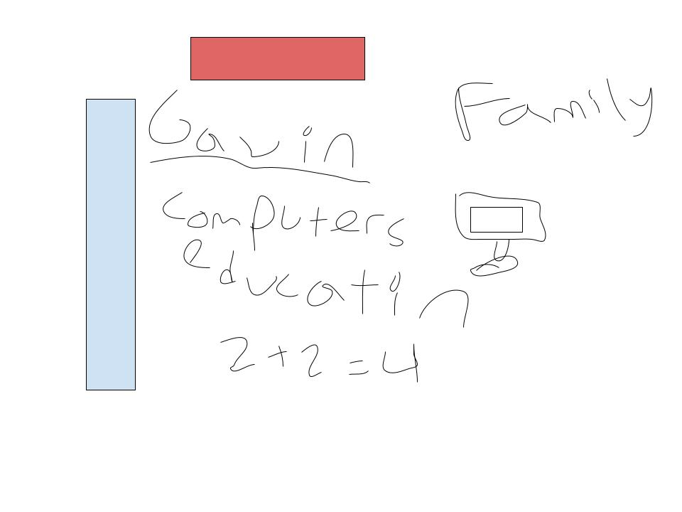

# Welcome to My Home Page!
Website by Gavin Copley (and from Mr. Mortensen)
 

This is my image. It has my two favorite colors, red and blue. It also has my name and things I value. I didn't have Freeform so I had to use Google Draw.
I hope I can learn how to code and how to make make/customize my own website.
  
 
### Helpful Resources
Overview of Hacks, Study and Tangibles

- Plans, Lists, [Scrum Boards](https://clickup.com/blog/scrum-board/) help you to track key events, show progress and record time.  Effort is a big part of your class grade.  Show plans and time spent!
- [Hacks(Todo)](https://levelup.gitconnected.com/six-ultimate-daily-hacks-for-every-programmer-60f5f10feae) enable you to stay in focus with key requirements of the class.  Each Hack will produce Tangibles.
- Tangibles or [Tangible Artifacts](https://en.wikipedia.org/wiki/Artifact_(software_development)) are things you accumulate as a learner and coder.
